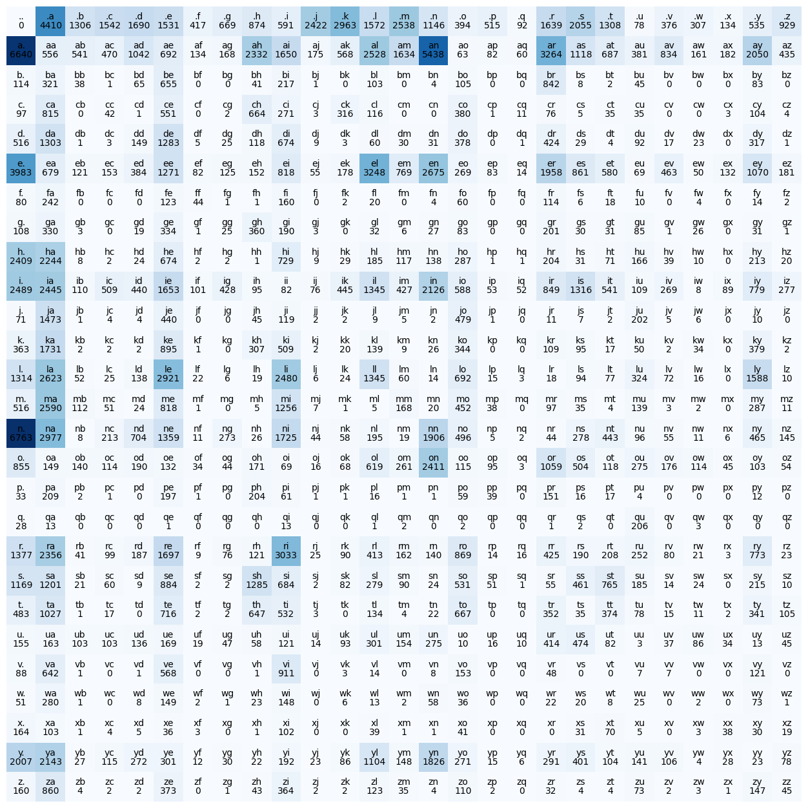

# Biagram & Single Layer Network
We introduce bigram character level language model. We saw how we can train the model, how we can sample from the model, and how we can evaluate the quality of the model using the negative log likelihood loss.

## Character level language model
Produce next character in the sequence. Like `isabella` where `s` is likely to come after `i`. After `isabella`, these 8 characters, the sequence is likely to end.

## Bigram
Bigram always works with 2 character at a time, i.e. only looking at one character we are given and try to predict the next character in the sequence.
* Focus on local structure of the sequence only.
### Read in dataset `names.txt`
```Python
Read => split lines to get a list
show first 10, max length, min length for info.
```
### Build a counts-based model
We expect to see appear times of each bigram and use it as probability to predict the next character.
1. `dict` base
```Python
Use a dict to count every zip appear times.
Traverse every word in words
Add <Start> word <End>. Replaced by .
Counts.
```
2. 2-D array(tensor)
* Row is the first character, column is the next character following the first one.
* Cell is the appear times as counts.
* `.` represents start and end
```Python
Traverse every word in words
Add <Start> word <End> in zip(word, word[:1]). Replaced by .
Map character to integer and accumulate counts in position.
Optional: plot it.
    .    a    b    e    i    l    s
.   0    0    0    0    i    0    0
a   1    0    1    0    0    0    0
b   0    0    0    1    0    0    0
e   0    0    0    0    0    1    0
i   0    0    0    0    0    0    1
l   0    1    0    0    0    1    0
s   0    1    0    0    0    0    0
```


### Sampling
1. Normalize each row of the 2-D matrix as a normalized probability distribution.
2. Use `torch.multinomial` to sample based on this distribution.
```Python
Starting from first row with index = 0 which represents .
Get probability distribution of this row # Replaced by vectorized probability.
While next itos[index] not .
    torch.multinomial()
    Sample an index as next character index
```
> In vectorized probability, refer to code to pay attention to broadcasting mechanism in torch. It determines whether you normalize by column or row.
> * TL;DR: `torch.sum(p, dim=x, keepdim=True)`, the `x` dim will be 1. 
> * Like `p.shape` is `[27, 27]`, after above, it will be `[27, 1]`. 

## Loss Function
We want to evaluate whether the predicted character is the expected one. The current probability distribution is within `[0, 1]`. We want to see the probability on the correct position and evaluate it. 
* If the probability on that position is 1, then there's no loss, otherwise farther the bigger the loss is. Then we use `log()` first to achieve this
* As we are predicting the name which is a sequence, we expect all character to be correct at the same time. So these probability should be multiplied. But for value within `[0, 1]`, the value will be tiny, so again, `log()` it. The multiplication will then be sum for log.

This is how max likelihood and log likelihood work. As log within `[0, 1]` will be negative, we will then `*-1` to convert it. Then it is called negative log likelihood loss.
```Python
for ch1, ch2 in zip()
    idx1, idx2 = stoi[ch1], stoi[ch2]
    prob = P[idx1, idx2]
    nll += -prob.log() / example_nums # for avg
```

## Neural Network
It's still in bigram setting: Given a character, output the probability of the next character.
1. Creating a training set. `xs, ys`
2. Feed the neural net
    * As we know, the neural network is a multi-`w*x+b` like model. So sole integer is not suitable as input.
    * One-hot encoding the x!
```Python
xs, ys = [], []
Same loop as before but append ch1, ch2 to xs, ys
torch.tensor(xs, ys) # torch.tensor() will automatically infer dtype.
import torch.nn.functional as F
F.one_hot(xs, num_classes=_).float() # Need float as input.
```
### One linear layer model
$y=wx+b$

For one sample feeds into one neuron, `x` is `1x27` as input, `w` should be `27x1`, then the output will be `1x1`

Same idea, if we would output probability for 27 character category, then we need 27 neurons. Then `x` is `1x27`, `w` is `27x27` output is `1x27`

```Python
W = torch.randn(size, requires_grad) # Generate a tensor a normal distribution. [Should have a figure here for normal distribution]
logits = xencoded @ W # Its shape will be [1, 27] 2D tensor
```
### Softmax
We want to get probs that are positive and sum to 1.
1. exp() it to make it positive. [Should have a figure here for exp() func]
2. `p` = $\frac{exp(logits)}{exp(logits).sum(dim=1, keepdim)}$

Then our goal is to optimize to find the best `W` s.t. the prob is good.

### Put all together
Regularization can be added to `loss` to smooth the output. When the weights are close to 0, all prob will be even. It's used to avoid overfitting and make it model to generalize to common cases. It has same effect to adding counts to cnt matrix.
```Python
xs, ys => to tensor
Init W, require grad

for step in steps:
    # Forward Pass
    xenc = F.one_hot(xs)
    logits = xenc @ W
    prob = logits.exp() / logits.exp().sum(1, keepdim)
    output = prob[examples_num, ys] # Prob on correct position
    loss = -output.log().mean() + 0.01 * W**2.mean() # Regularization
    print(loss)

    # Backward pass
    W.grad = None # To ensure not accumulate
    loss.backward()
    with torch.no_grad(): # not include this ops into comp graph
        W += -0.1 * W.grad
```
### Sampling
```Python
Starting from first row with index = 0 which represents .
# Get probability distribution of this row
# Replaced with forward pass
xenc = F.one_hot(tensor([idx]))
logits => prob

While next itos[index] not .
    torch.multinomial()
    Sample an index as next character index
```

## Comparison of two models
1. weights is as same as the counts in the matrix in cnt based model but normalized and exp()ed. -> one hot encoding really just selects a row of the next charachter weights.
2. model smoothing as regularization. As we increase the cnts in cnt-based model, the distribution will be more uniformed and goes to more and more even probability. Initializing w is the same effect if w all same or 0, the probability will be the same. Regularization loss to incentivize w to near 0 is equalvalent to label smoothing which is also to avoid overfitting and make the model to be more generalized.
    * Augment the loss function by adding a small component. 
W**2.mean()
    * `loss = probs[torch.arange(examples_num), ys].log().mean() + 0.01 * W**2.mean()`

## Results and Conclusion
We actually train the model in two completely different ways that actually get the same result.

* In first way, we just counted up the frequency of all the bigrams and normalized.
* In a second way, we used the negative log likelihood loss as a guide to optimizing the counts matrix so the loss (and the regularization item) is minimized in a gradient-based framework.

And we saw that both of them give the same result. And the gradient-based framework is much more flexible and right now our neural network is super simple that we are taking a single previous character and we are taking it through a single linear layer to calculate the logits. This is about to complexify.

Big shout out to Andrej Karpathy. This is replicating his buildmore work.

