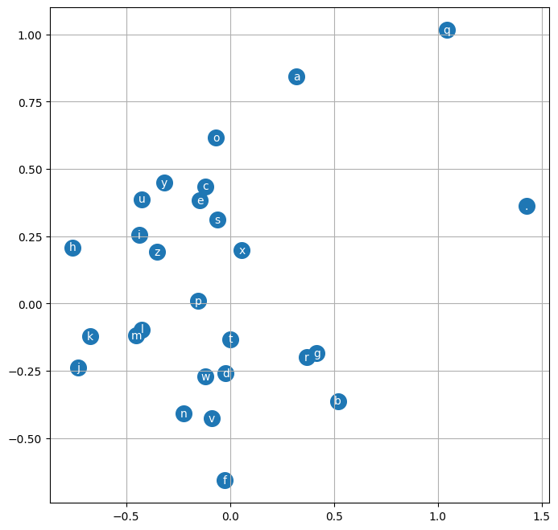

# MLP
Based on the single layer network built before, we step one more further to build an MLP which basically add hidden layers between input and output. We show that the performance is much better.

We now have a model that can deal with one character of previous context. But the prediction was now good. One way to improve is to add more context character, but how? If we use 2-D matrix to have exist times, we simply stack way more rows and probs which will be computing expensive. So we introduce MLP(Multi Layer Perceptron) to complexify the model.

Referenced Paper: [A Neural Probabilistic Language Model](https://www.jmlr.org/papers/volume3/bengio03a/bengio03a.pdf). Yoshua Bengio, Rejean Ducharme, Pascal Vincent, Christian Jauvin


## Data
* Open the same `names.txt` file and spilt based on lines.
* Prepare `stoi`, `itos`
* Introduce a new variable `block_size` as previous context.
```Python
xs, ys = [], []
for name in names:
    context = [0] * block_size
    for ch in name+".":
        idx = stoi[ch]
        xs.append(context), ys.append(idx)
        context = context[1:] + [idx]
```

## Train on first 5 words
### Embedding Lookup Table
`xs.shape() = (32, 3), y.shape() = (32,)`

Look up table is basically same as 
* `xenc = F.one_hot(xs)` which generates `(32, 3, 27)`
* `xenc @ W` where `W` is `(27, embedding_dim)`
* For `x=5`, `F.one_hot(x) @ W == W[5]` where `1x1x27 * 27x2`

In originally paper, they encode words to embedding. And the word size is 17,000 and the embedding dimension is 30-d space.
Here we are doing character-level model, and we encode 27 character to say 2 or 10 -d space as you like.

```Python
# Encode each character to 2-dim embedding
C = torch.randn((27, 2))
emb = C[xs] # (32, 3) => (32, 3, 2)
```
### Hidden Layer

In the hidden layer we basically do the same thing as in single layer network. But instead of mapping input into output, we now map them into a larger dimension with more parameters.

When implementing, the `emb.shape = (32, 3, 2)` which not match the shape of `W2`, we have several ways to align
* torch.concat, pick the list of wanted dimension and concat them to another dim
* torch.unbind, the list will be automatically picked and concat as above
* torch.view, most efficient that optimized by torch
```Python
hidden_dimension = 100
W1 = torch.randn((3*2, hidden_dimension))
b1 = torch.randn(hidden_dimension) # (1, 100) => (32, 100)
h = emb.view(32, 6) @ W1 + b1
```
### Output Layer
Same as previous single neural network
* Get logits
* Exp logits
* Normalized exped logits => probs (every row sun to one)
* Loss = -probs[torch.arange, ys].mean()

But now, we introduce `F.cross_entropy` which is
* simplifying mathematically the math expression in backward()
* not creating intermediate variables in forward()
* numerically well-behaved where logits can be scaled and very large positive number will be NaN after exp. 
    * `[-5, 5, 100] - max([-5, 5, 100])` can save. That's how torch optimize it.
```Python
logits = h @ W2 + b2
loss = F.cross_entropy(logits, ys)
```
### Backward
```Python
parameters = [C, W1, b1, W2, b2]
for p in parameters:
    p.require_grad = True

for step in steps:
    # Forward
    # Backward
    for p in parameters:
        p.grad = None
    loss.backward()

    for p in parameters:
        p.data += -lr * p.grad
```
It can not be overfitting as the character after the starting `.` can be anything
## Training on full dataset
If we use full dataset instead of first 5 words to train one iteration, it will be super slow.
* Minibatch: Randomly sample few (typically 32, 64, ...) samples to feed into the network.
* We will have small gradient per iteration and update a few
* For bigger model, small gradient caused by small batch size will not make the update well.
```Python
for name in names:
    idx = torch.randint(0, names.shape[0], (32,))
    emb = C[xs[idx]]
```

To pick a better learning rate, we don't want it to be too large to oscillate or too small to converge to slow.
* `lr_exp = torch.linspace(-3, 0, 100); lr = 10 ** lr_exp` 
* Instead of `torch.linspace(0.001, 1, 1000)` cause the log scale better and fairly evenly from 0.001 -> 0.01 -> 0.1 -> 1 rather than linearly scale.
* At each step, pick one lr. Append lr and loss and plot them to choose best lr.

Then starting from the best lr, then decay after training for few iterations

## Better Evaluation
As we train the model, our model wil be more capable of overfitting on training set. The loss on training set will be then very low as it memorizes them. 
Even though we get low loss as above, we can't evaluate the performance for characters the model haven't seen before.

A typical way is to divide the full dataset into 3 sub-set, 
* 80% training set. Used for train parameters
* 10% validation set. Used for tuning hyper parameters
* 10% test set. For final evaluation

```python
def build_dataset(words):
    block_size = 3
    for word in words:
        context = [0] * block_size
        for ch in word+".":
            idx = stoi[ch]
            xs.append(context), ys.append(idx)
            context = context[1:] + [idx]
    xs, ys = torch.tensor(xs), torch.tensor(ys)

# Split name samples in words. Actual context sample will be more
train_idx = int(0.8 * len(words))
val_idx = int(0.9 * len(words))

x_train, y_train = build_dataset(words[:train_idx])
```

## Improvement
### Wider hidden layers
```python
hidden_dimension = 200
W1 = torch.randn((3*2, hidden_dimension))
b1 = torch.randn(hidden_dimension) # (1, 200) => (32, 200)
W2 = torch.randn((hidden_dimension, 27))
b2 = torch.randn(27)
```

But just add more neurons per layer has bottlenecks that the input embedding is only 2-D dim so that the hidden layer can not learn the patter well

### Larger embedding
For 2-D trained embedding, we can see below. where `m` and `l`, `r` and `g` has similar feature while `.` is regarded as special.


Then we can scale up the emb dimension for model.
```python
C = torch.randn((27, 10))
emb = C[x_train[idx]] # (32, 3, 10)

hidden_dimension = 200
W1 = torch.randn((3*10, hidden_dimension))
b1 = torch.randn(hidden_dimension) # (1, 200) => (32, 200)
W2 = torch.randn((hidden_dimension, 27))
b2 = torch.randn(27)
```
## Conclusion
We achieve way better metric-wise loss performance. Also the sampling generates more reasonable names. There are still few ways to improve the model.
* The number of neurons in the hidden layer
* The dimensionality of embedding lookup table
* The number of characters that are feeding in as context in the model
* Details of the optimization:
    * How many steps are we running?
    * What is the learning rate? How it changes over the time?
    * Batch size => a much better convergence speed