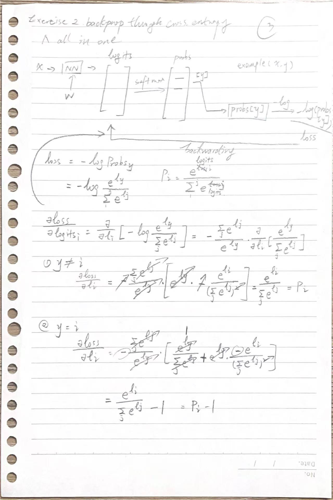
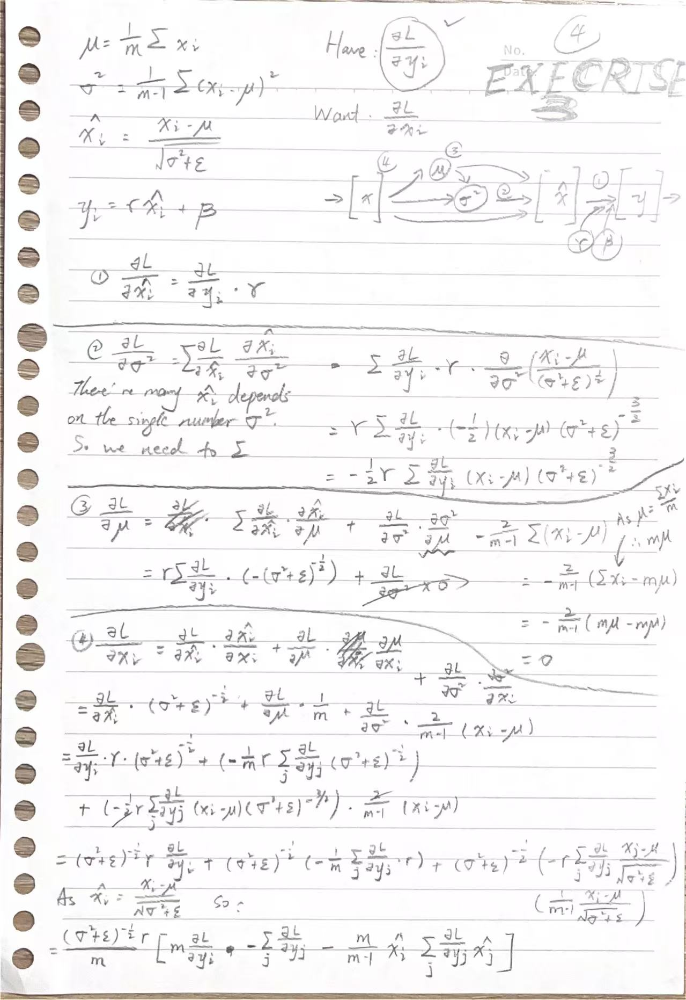

# Backprop Ninja
We manually backprop the neural network by breaking down every operation and replace `loss.backward()` with our hand-made one.

It gave us a pretty nice diversity of layers to backprop through. It also gave us a pretty nice and comprehensive sense of how these backward passes are implemented and how they work. You will have some intuition about how gradients flow backwards throughthe neural net starting at the loss and how they flow through all the variables and all the intermediate results.
```python
# Now we will replace this with our hand-made backward()
# loss.backward()
```


## Exercise 1: Backprop step by step
To better understand how gradients flow through the neural network, we carefully scrutinize the backpropgation process.
```python
emb = C[Xb]
embact = emb.view(emb.shape[0], -1)
# Linear layer 1
hprebn = embact @ W1 + b1 # hidden layer pre-activation
# BatchNorm layer
bnmeani = 1/n * hprebn.sum(dim=0, keepdim=True)
bndiff = hprebn - bnmeani
bndiff2 = bndiff ** 2
bnvar = 1/(n-1) * bndiff2.sum(dim=0, keepdim=True) # Bessel's correction: dividing by n-1
bnvar_inv = (bnvar + 1e-5)**-0.5
bnraw = bndiff * bnvar_inv
hpreact = bngain * bnraw + bnbias
# Non-linearity
h = torch.tanh(hpreact)
# Linear layer 2
logits = h @ W2 + b2 # Output layer
# Cross entropy loss
logit_maxes = logits.max(dim=1, keepdim=True).values
norm_logits = logits - logit_maxes # Subtract maxes for numerical stability
# End up exponetiating logits, if not norm logits, will cause numerical issue when too positive.
counts = norm_logits.exp()
counts_sum = counts.sum(dim=1, keepdim=True)
counts_sum_inv = counts_sum**-1
probs = counts * counts_sum_inv # !!! Shape is different. So broadcasting -> times. When a node is used several times, the gradients should be summed up.
logprobs = probs.log()
loss = -logprobs[range(batch_size), Yb].mean()
```
1. For the derivative of `xxx.mean()`
   1. `xxx.mean()` <= $\frac{(prob_{1,13}+prob_{2,2}+prob_{3,15}+prob_{4，1}+...)}{n}$ probs are from the selected position at each row. Others should be 0
   2. Prepare a `torch.zeros_like(logprob)`
   3. Assign `1.0/n` to selected position
2. Remember the chain rule.
3. Before calculate the gradients, check the shape first.
4. If the variable has been broadcast, it means a same variable has been used several time. So perform `xxx.sum(dim=x)` keepdim or not is case by case.
5. Make sure if the variable depends multiple branch, if so summing them up.
6. For `xxx.sum()`
   1. `xxx.sum()` <= $a_{11}+a_{12}+a_{13}=b_{11}$
   2. The derivative for each $a$ is 1.
   3. Prepare `torch.ones_like()` then chain rule.
7. For `xxx.max(dim=y)`,
   1. `dxxx = F.one_hot(xxx.max(dim=y, keepdim=False).indices, xxx.shape[y]) * dlogit_maxes` 
8. For matrix multiplication, derive a simple case by yourself would help understand. Also the shape info help as well.
   1. `logits = h @ W2 + b2`
   2. `dh = dlogits @ W2.T`
   3. `dW2 = h.T @ dlogits`
   4. `db2 = dlogits.sum(dim=0)`


## Exercise 2: Cross entropy backward pass
In practice, we will not separate out loss calculation into multiple lines as small atomic pieces and we backproped them individually. Mathematically, some items can be cancelled and the expression can be shortened.

Forward pass: 
```python
# Cross entropy loss (same as F.cross_entropy(logits, Yb))
logit_maxes = logits.max(dim=1, keepdim=True).values
norm_logits = logits - logit_maxes
counts = norm_logits.exp()
counts_sum = counts.sum(dim=1, keepdim=True)
counts_sum_inv = counts_sum**-1
probs = counts * counts_sum_inv
logprobs = probs.log()
loss = -logprobs[range(batch_size), Yb].mean()
```

Backward pass:
```python
dprobs = (1.0 / probs) * dlogprobs
dcounts_sum_inv = (counts * dprobs).sum(dim=1, keepdim=True)
dcounts = counts_sum_inv * dprobs # [32,1] * [32, 27]
dcounts_sum = -counts_sum**(-2) * dcounts_sum_inv
dcounts += torch.ones_like(counts) * dcounts_sum

dnorm_logits = dcounts * counts
dlogits = dnorm_logits.clone()
dlogit_maxes = -(dnorm_logits).sum(1, keepdim=True)
dlogits += F.one_hot(logits.max(dim=1, keepdim=False).indices, logits.shape[1]) * dlogit_maxes
```

Proof:



## Exercise 3: Batch Normalization backward pass
Do the same thing as what we did for cross entropy loss in exercise 2. We consider it as a glued single mathematical expression and backpropgate through it in a very efficient manner.

Forward pass:
```python
# BatchNorm layer
bnmeani = 1/n * hprebn.sum(dim=0, keepdim=True)
bndiff = hprebn - bnmeani
bndiff2 = bndiff ** 2
bnvar = 1/(n-1) * bndiff2.sum(dim=0, keepdim=True) # Bessel's correction: dividing by n-1
bnvar_inv = (bnvar + 1e-5)**-0.5
bnraw = bndiff * bnvar_inv
hpreact = bngain * bnraw + bnbias
```

Backward pass:
```python
dhpreact = dh * (1 - h**2)
dbngain = (dhpreact * bnraw).sum(dim=0, keepdim=True)
dbnraw = dhpreact * bngain
dbnbias = dhpreact.sum(dim=0, keepdim=True)

dbndiff = bnvar_inv * dbnraw
dbnvar_inv = (dbnraw * bndiff).sum(dim=0, keepdim=True)
dbnvar = dbnvar_inv * (-0.5 * (bnvar + 1e-5)**-1.5)
dbndiff2 = dbnvar * (1.0/(n-1)) * torch.ones_like(bndiff2)
dbndiff += 2 * bndiff * dbndiff2
dbnmeani = (dbndiff * -1.0).sum(dim=0)
dhprebn = dbndiff.clone()
dhprebn += dbnmeani * (1/n) * torch.ones_like(hprebn)
```

Proof:



## Exercise 4: Put all in one go
Notice that He/Kaiming init is just used for hidden layer that include activations where keeping variance is important for stable forwarding.

```python
# Backward pass
for p in parameters:
   p.grad = None
# Now we will replace this with our hand-made backward()
# loss.backward()

# Mannual backward pass
# ---------------------------------------------------------------
dlogits = F.softmax(logits, dim=1)
dlogits[range(n), Yb] -= 1
dlogits /= n
# 2nd layer backprop
dh = dlogits @ W2.T
dW2 = h.T @ dlogits
db2 = dlogits.sum(dim=0)
# Tanh
dhpreact = dh * (1 - h**2)
# batchnorm backprop
dbngain = (dhpreact * bnraw).sum(dim=0, keepdim=True)
dbnbias = dhpreact.sum(dim=0, keepdim=True)
dhprebn = bngain*bnvar_inv/n * (n*dhpreact - dhpreact.sum(dim=0) - n/(n-1) * bnraw * (dhpreact*bnraw).sum(0))
# 1st layer backprop
dembact = dhprebn @ W1.T
dW1 = embact.T @ dhprebn
db1 = dhprebn.sum(dim=0)
# embedding
demb = dembact.view(emb.shape)
dC = torch.zeros_like(C)
for row in range(Xb.shape[0]):
   for column in range(Xb.shape[1]):
         row_of_C = Xb[row, column]
         dC[row_of_C] += demb[row, column]
grads = [dC, dW1, db1, dW2, db2, dbngain, dbnbias]
# ---------------------------------------------------------------
```
## Conclusion
Everything is the same, but of course the big deal is that we did not use `loss.backward()` and pytorch auto grad and we estimate gradients ourselves by hand.

It gave us a pretty nice diversity of layers to backprop through. It also gave us a pretty nice and comprehensive sense of how these backward passes are implemented and how they work. You will have some intuition about how gradients flow backwards throughthe neural net starting at the loss and how they flow through all the variables and all the intermediate results.