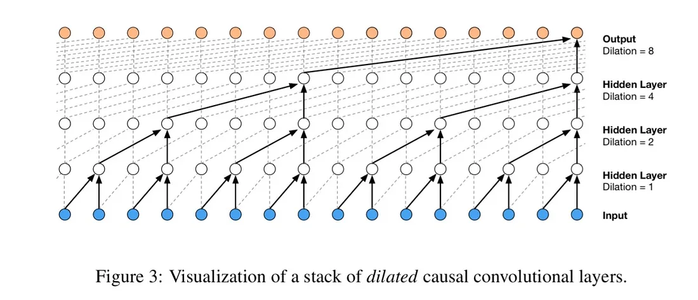

# WaveNet
The goal is complexify the previous 1-hidden layer multi-layer perceptron.
* More characters in a sequence as context
* Using the architecture similar to WaveNet rather than squashing too much information quickly in one single hidden layer.


## Starter Code
The starter code is copied and pasted from previous PyTorchified code blocks to construct our neural network.

## Further PyTorchifying
Building on previous code, we further build 
* `class Embedding`
* `class Flatten`
* `class Sequential` container
to achieve the similar effect as `torch.Embedding`, `torch.Flatten`, and `torch.nn.Sequential`

## Increase `block_size` to 8
```python
block_size = 3 # context_length: how many characters do we take to predict the next one?
```

## Tensor inspection
Before constructing WaveNet, we first look at the forward pass of the neural net, and inspect the shape of the tensors along the way as the neural net forwards.

Then we tested the matrix multiplication mechanism of PyTorch and observed that
```python
(torch.randn(4, 5, 2, 80) @ torch.randn(80, 200) + torch.randn(200)).shape
```
the matrix multiplication will only work on the last dimension. So the result of the above code block will be `4, 5, 2, 200`, which would help us serve those 80 character embeddings in a different way.

## WaveNet construction
1, 2, 3, 4, 5, 6, 7, 8

Now we don't want to flatten all these 8 characters as we don't want to Matrix multiply 80 into a weight matrix multiplication immediately. Instead, we want group these. Every consecutive elements should be flattened out as 4 groups.

(1, 2,) (3, 4,) (5, 6,) (7, 8)

Then we can use this
```python
# We only want 2 character to come in on the very first layer.
# Those 2 characters shuold be fused.
(torch.randn(4, 4, 20) @ torch.randn(20, 200) + torch.randn(200)).shape
```
to get `4, 4, 200`. We will adapt `Flatten` to `FlattenConsecutive` to implement this in our model. Basically `x.view(B, T // n_consecutive_characters, n_consecutive_characters * embd_dim)`

The model will then be
```python
model = Sequential([
    Embedding(vocab_size, n_embd), 
    FlattenConsecutive(n=2), Linear(n_embd * 2, n_hidden, bias=False), BatchNorm1D(n_hidden), Tanh(),
    FlattenConsecutive(n=2), Linear(n_hidden * 2, n_hidden, bias=False), BatchNorm1D(n_hidden), Tanh(),
    FlattenConsecutive(n=2), Linear(n_hidden * 2, n_hidden, bias=False), BatchNorm1D(n_hidden), Tanh(),
    Linear(n_hidden, vocab_size),
])
```

## Fix BatchNorm 1D bug
We currently assume x is a 2D tensor and only reduce the mean and the variance over the 0 dimension.
```python
def __call__(self, x):
    # If training, calculate the mean and std for x. Otherwise, use the buffer
    if self.training:
        xmean = x.mean(dim=0, keepdim=True)
        xvar = x.var(dim=0, keepdim=True)
    else:
        xmean = self.mean_running
        xvar = self.var_running
    # Normalize to unit variance as xhat
    x_hat = (x - xmean) / torch.sqrt(xvar + self.eps)
    # Scale and shift to out.
    self.out = self.gamma * x_hat + self.beta
    # Update mean and std buffer if training with momentum update. without grad.
    if self.training:
        with torch.no_grad():
            self.mean_running = (1 - self.momentum) * self.mean_running + self.momentum * xmean
            self.var_running = (1 - self.momentum) * self.var_running + self.momentum * xvar
    return self.out
```
But now the x is 3 dimension, how come it can still run w/o any errors?

The reason is that everything just broadcast properly but the `BatchNorm` is not doing what we want it to do.

Solution:
* `torch.mean()` can reduce the mean over multiple dimensions at the same time. The input can be a tuple.

We are now calculating the means and variances across [32, 4] dimensions.

```python
emean = e.mean(dim=(0, 1), keepdim=True)
evar = e.var(dim=(0, 1), keepdim=True)
e_hat = (e - emean) / torch.sqrt(evar)
print(emean.shape, evar.shape, e_hat.shape)
```

## Takeaway
1. Reimplemented the `torch.nn` blocks to construct neural network, unlock more in the future.
2. The development process
    1. Read documantation of PyTorch.
    2. Make the shapes work. So Andrej always prototypes these layers in jupyter notebook and make sure all the shapes work out, then copy and paste them into the actual codebase.
3. Future: 
    1. implement dilated convolutions.
    2. Residual and skip connections.
    3. Experimental harness. Currently just guess and check everything, which is not representative of typical deep learning workflows.
        1. Set up evaluation harness
        2. Kick off experiments where you have several arguments that your script can take.
        3. Looking at a lot of plots of training and validation losses
        4. Looking at what is working and what is not working
        5. Working on above population level for hyper parameter searches.